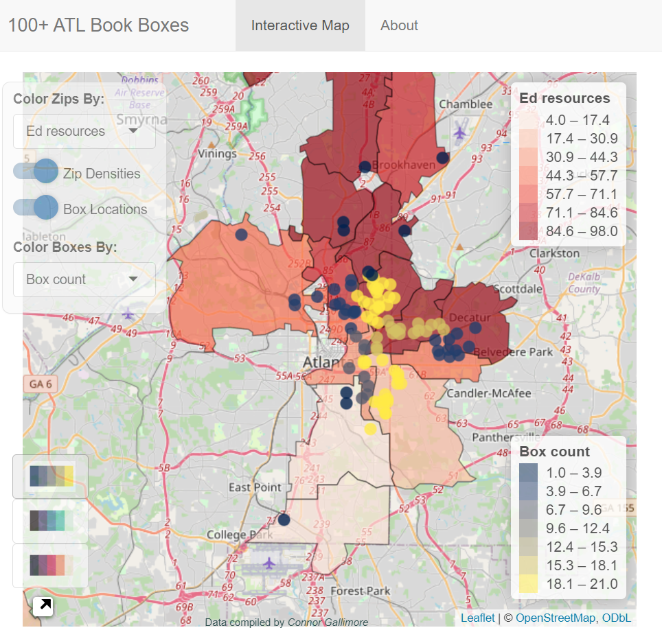

# ATL-book-boxes

Plot the locations of over 130 public bookcases in the Greater Atlanta Area. The `main` branch of this repository reflects the up-to-date source code and data for the [R shiny app](https://cgallimore25.shinyapps.io/ATL-book-boxes/) it produces.

  

## Inspiration

In 2023, I noticed that many of the public bookcases in my area were not listed on the Little Free Library web map.
I began recording longitude and latitude coordinates for the ones I discovered and cross-referencing them with the listings.
The result is this dataset of 132 book boxes in the Greater Atlanta area.

### The Child Opportunity Index

With an interest in indicators and issues of health, education, safety, and socioeconomic inequity, I incorporated nationally normalized zip code estimates from the [Child Opportunity Index](https://www.diversitydatakids.org/child-opportunity-index?_ga=2.130754447.1489633750.1679850921-1316632825.1679594824) (COI).
The COI is a composite index of children's neighborhood opportunity, consisting of 3 major domains: Education (ED), Health and Environment (HE), and Social and Economic factors (SE).
This app allows visualization of COI measures alongside the distribution of Atlanta's bookcases.

### Data

The [/data](/data) directory contains the box locations and COI measures as `.csv` files, as well as a geojson encoding Georgia zip code spatial data.
The `process_to_rds.R` script converts these to `.rds` and `.shp` files, which are loaded directly to minimize pre-processing at app runtime.

## How you can contribute

Anyone can collect and submit data for incorporation in the map!
It's as easy as standing front of a book box, opening your google maps app, and long-clicking on the position in front of you to get latitude and longitude coordinates.
These can be copy-pasted and sent via email linked in the app, or the one associated with this GitHub profile.

### Contributors

The following people submitted coordinates to new book boxes. Thanks!

- Nishant Mohan
